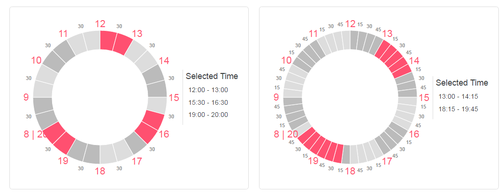

# react-timespan-picker
React component of circular timespan-picker. New convinient UI control to pick up a short time periods during a day.
It can replace hundreds of boring checkboxes if you plan to mark any availability during a day (e.g. in cases like this http://www.timebie.com/std/centraleuropeansummer.php)



## Example
Please see example here https://gooduling.github.io/react-circular-timepicker/
## Use
```
<Timepspanpicker
    outerRadius="100"
    interval="30"
    boundaryHour="20"
    onClick={handleResults}
    showResults
/>
```

## API
You can set such properties:

- outerRadius - [Number] - any radius size in pixels. By default is 150;
- interval - [Number] - the step of hour division in range 1-60 limitrd by condition: modulo (60 % interval) === 0. By default is 30; 
- boundaryHour - [Number] - An hour which define the begining of 12-hour timespan enabled for choice. E.g. you can set 8:00 - 20:00 timespan, or 16:00 - 4:00 enabled timespan. - By default is 8;
- onClick - [Function] - a handler function which recieve all choosed timeset as a single argument. The result of choice is moment.js object (See http://momentjs.com/)
- showResults - [Boolean] - Hide or show a text block with current results of choice. By default is false.

## Dependency
React, momentJS, d3
